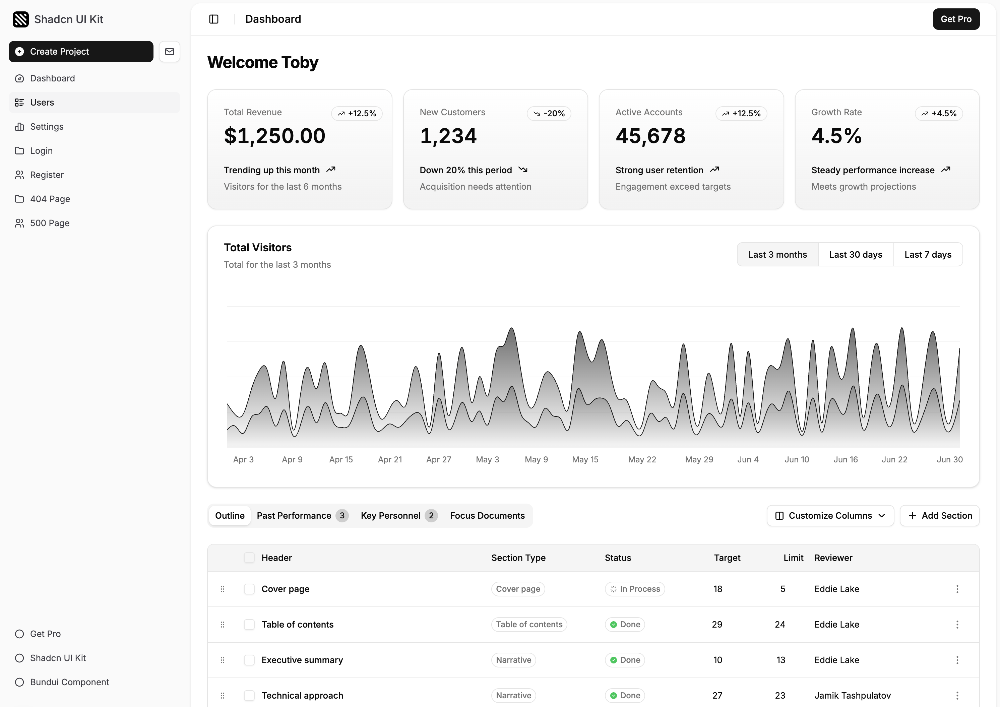
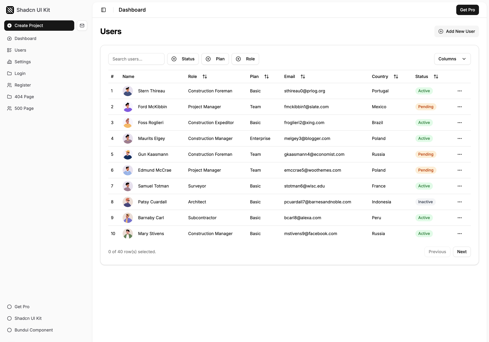

**AgencyOS** — Solo operations dashboard (clients, projects, tasks, invoices, files). Full project docs: **[docs/](docs/README.md)** (overview, architecture, database, modules, API, decisions, changelog, TODO).

 

  

  <h3 align="center">Shadcn UI Kit</h3>

  

    Shadcn UI Kit is a comprehensive collection of ready-to-use admin dashboards, website templates, and customizable components.
     
     
    <a href="https://shadcnuikit.com/">Home Page</a>
    &nbsp;&bull;&nbsp;
    <a href="https://shadcnuikit.com/dashboard/default">Dashboards</a>
    &nbsp;&bull;&nbsp;
    <a href="https://shadcnuikit.com/templates">Templates</a>
    &nbsp;&bull;&nbsp;
    <a href="https://free.shadcnuikit.com/">Free</a>
  

     

## 💎 About Shadcn UI Kit

**Shadcn UI Kit** is a comprehensive and versatile collection of ready-to-use admin dashboards, website templates, and fully customizable components designed for modern web applications. It goes beyond standard UI libraries by offering enhanced functionality, greater design flexibility, and a seamless user experience. Whether you're building complex admin panels or sleek landing pages, Shadcn UI Kit provides the tools you need to create visually appealing and highly functional interfaces with ease.

## 🪄 Get Lifetime Access (PRO)

Get lifetime use of the premium version of Shadcn UI Kit with hundreds of UI components, dashboards, website templates and pre-built pages. Free updates, newly added components and templates are also included.

| Free Version   | [Shadcn UI Kit PRO](https://shadcnuikit.com/pricing) |
| -------------- | ---------------------------------------------------- |
| 1 Dashboard    | ✔ 10 Dashboards                                     |
| 5+ Pages       | ✔ 50+ Pages                                         |
| 1 Color Scheme | ✔ 10+ Web Apps                                      |
|                | ✔ 100+ Premium Components                           |
|                | ✔ Premium Templates                                 |
|                | ✔ 5+ Color Schemes                                  |
|                | ✔ Theme Customization                               |
|                | ✔ Dark/Light Mode 🌙                                |
|                | ✔ LTR/RTL Support                                   |
|                | ✔ New Sidebar                                       |
|                | ✔ Multiple Layouts                                  |
|                | ✔ and more..                                        |

✅ [Click here](https://shadcnuikit.com/pricing) to get the Shadcn UI Kit and review it in detail

## ✉️ Contact

Toby Belhome - [@TobyBelhome](https://x.com/TobyBelhome)

(<a href="#readme-top">back to top</a>)

